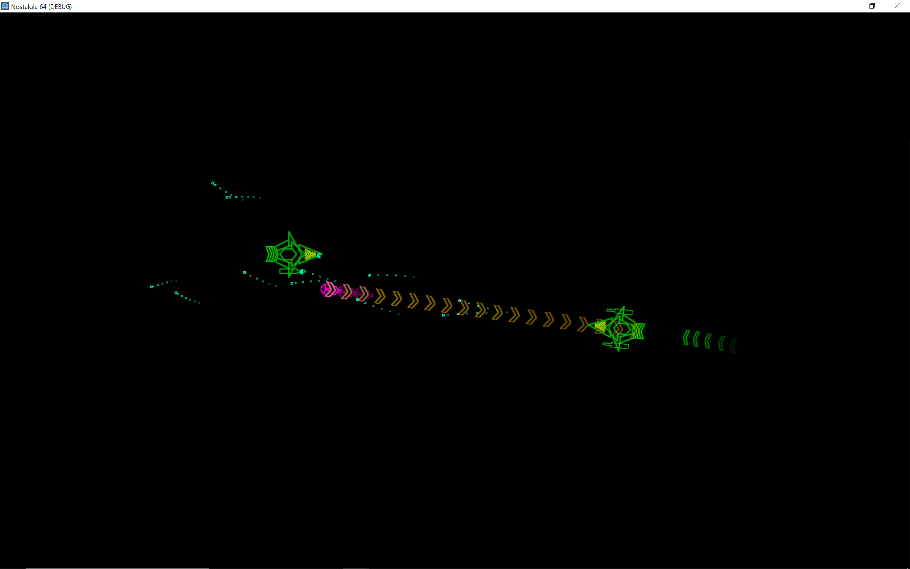

# Nostalgia 64 (Godot)

[Live Demo](https://archcannon.art/nostalgia64)

Nostalgia 64 is a physics-based spaceship fighting game. Take control of a heavy ship with three thrusters and three weapons, and avoid spinning out of control as you struggle against enemies in the cold, hard void.

- Every part of your ship is a weapon
  - Your three thrusters fire damaging exhaust particles.
  - Your left, right, and special weapons fire standard attacks
  - Your hull deals impact damage on collision
- Every part of your ship is destructible
  - And losing each part makes it unusable for the rest of the fight
  
This project is a port of an earlier project called Nostalgia 64 (Unity).
  
# Credits
- Special thanks to Alexander Puh for the original 2017 design of the Greenhorn-class heavy gunship as it appeared in Nostalgia 64 (Unity).
  
## Ships
### Greenhorn
This heavy gunship features a unified thruster, two wavy energy beams, and a wave weapon capable of pulling enemies closer

- Fire Left: Wavy energy beam
- Fire Right: Wavy energy beam
- Fire Special: Force wave

### Greenhorn-III
This heavy gunship features a unified thruster, two super-fast energy beams, and a cyberweapon that makes ships to spin out of control

- Fire Left: Speedy energy beam
- Fire Right: Speedy energy beam
- Fire Special: Cyberdeck

## Controls
| Key   | Action |
| :---- | :----  |
| A     | P1 Thrust Left |
| S     | P1 Thrust Middle |
| D     | P1 Thrust Right |
| Q     | P1 Fire Left |
| E     | P1 Fire Right |
| F     | P1 Fire Special |
| Left  | P2 Thrust Left |
| Up    | P2 Thrust Middle |
| Right | P2 Thrust Right |
| Alt   | P2 Fire Left |
| Ctrl  | P2 Fire Right |
| Shift | P2 Fire Special |
